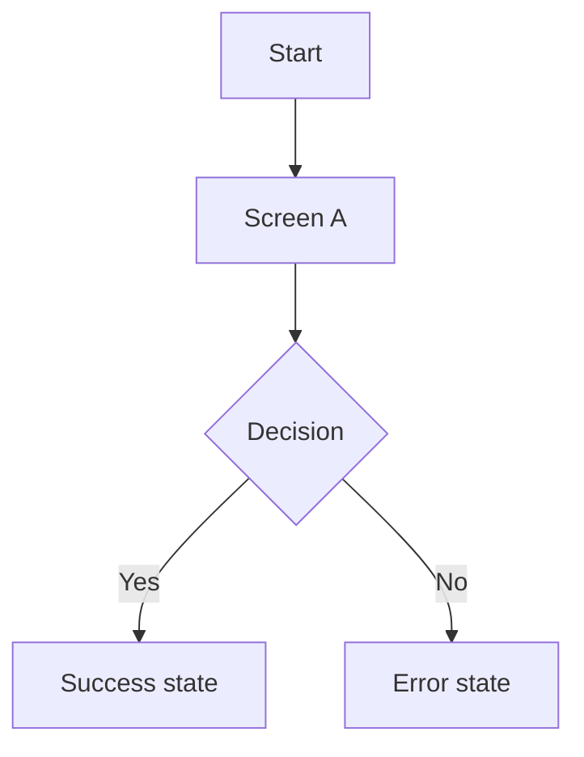

# Deliverables templates (native iOS + Android)

Use these sections as copy/paste templates. Keep content concise and engineer-ready.

## Mobile UX spec (Markdown)

### 1. Summary

- Problem statement
- Target users
- Success metrics
- Scope (MVP) and non-goals

### 2. Assumptions and open questions

- Assumptions (explicit)
- Open questions (with owners if known)

### 3. Information architecture (IA)

- Screen map grouped by feature area
- Entry points (cold start, deep link, push)

### 4. User flows (critical paths)

Provide Mermaid flowcharts:

### 5. Screens (wireframe index)

For each screen:

- Name and purpose
- Primary actions
- Inputs and validation
- Loading / empty / error states
- Accessibility notes
- Analytics events (optional)

### 6. Components inventory

For each component:

- Name and purpose
- Variants (size, style)
- States (default/pressed/disabled/loading/error/focused)
- Content rules (truncation, line limits)
- Accessibility (label, role, focus order)

### 7. Design tokens

- Token naming rules
- Token list (colors, typography, spacing, radius, elevation)
- Platform mapping notes (iOS/Android)

### 8. Handoff notes

- Navigation patterns and back behavior
- Safe area/insets behavior
- Localization notes (text expansion)
- Risks and tradeoffs

## Wireframe acceptance checklist

- Critical paths covered end-to-end
- At least one failure path per critical flow
- Loading / empty / error states included for data screens
- Forms include validation and helper/error copy
- Tap targets and font scaling considered
- iOS and Android differences called out when needed
